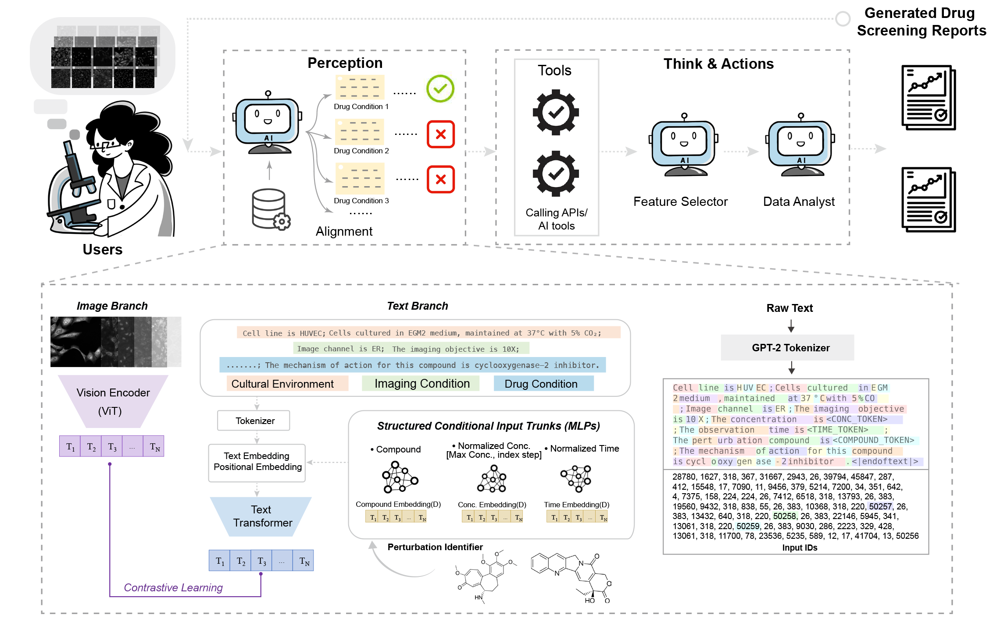

# CP-Agent

**CP-Agent: Context-Aware Multimodal Reasoning for Cellular Morphological Profiling under Chemical Perturbations**

> 🔍 A modular, interpretable, and agentic framework for analyzing Cell Painting perturbation data using multimodal large language models (MLLMs) and image-based reasoning.

---

## 📌 Overview

CP-Agent is a modular multimodal agent system that supports human-interpretable reasoning for drug-induced cellular morphology changes captured by **Cell Painting** assays. It integrates high-content imaging, structured metadata, and agent-driven analysis to generate mechanism-aware reports.

At its core, CP-Agent includes:
- `CP-CLIP`: A contrastive learning module aligning Cell Painting images with structured experiment metadata.
- `CP-Agent`: A reasoning pipeline that synthesizes visual features and context into interpretable biological reports.


---

## 🧠 Key Features

- ✅ **Context-aware representation** of experimental metadata (e.g., cell line, dose, time)
- ✅ **Multimodal alignment** of image and molecular descriptors via CP-CLIP
- ✅ **Mechanistic reasoning** using LLM agents and CellProfiler features
- ✅ **Zero-shot generalization** to unseen compounds


---

## 🛠️ Usage Guide

You can run **CP-Agent** either as a script or step-by-step in a notebook:
To set up the environment and install all dependencies, run:

```bash
pip install -r requirements.txt
```
This will set up the full environment needed to run CP-Agent, including image processing, deep learning, and LLM integration components.

> ✅ It's recommended to use a virtual environment (e.g., `venv` or `conda`) and Python 3.9–3.11.
> ⚠️ Note: Some packages will be installed directly from GitHub (e.g., `segment_anything`). Make sure `git` is available in your environment.
All configurable parameters (e.g., input image paths, output locations, analysis options) can be customized in:

```
config.py
```

To run the end-to-end pipeline and generate a full report:

```bash
python cpagent_reportGen.py
```


You can step through each stage interactively in the provided Jupyter notebook:

```bash
jupyter notebook cp-agent_demo.ipynb
```

To help you get started, we’ve included example Cell Painting images in:

```
example_images/
```

These image pairs (control vs perturbation) can be used to test the pipeline or fine-tune your configuration.

📌 **Tip**: Make sure the image paths in `config.py` are pointing to the correct files in `example_images/`.


## 📁 Project Structure
<pre><code>

cp-agent/

├── cpclip/ # CP-CLIP model and training

├── featureExtractor/ # Feature extraction wrappers

├── reasoning_utils/ # Agent modules (FeatRank, ReportGen, etc.)

├── segmentor/ # Segmentation pipeline (e.g., VISTA-2D)

├── metadata/ # Curated experimental metadata

├── results/ # Sample outputs and reports

├── example_images/ # Example Cell Painting images

├── cp-agent_demo.ipynb # Jupyter demo notebook

├── cpagent_utils.py # Utility functions

├── cpagent_reportGen.py # Report generation logic

├── config.py # Configuration settings

└── requirements.txt # Python dependencies

</code></pre>

